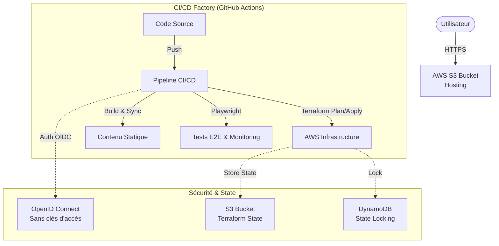

## Mon Voyage GitOps avec Terraform sur AWS

Bienvenue dans le récit de ma transformation digitale personnelle ! J'ai récemment migré mon site web portfolio vers une architecture **GitOps** entièrement automatisée sur AWS, en utilisant **Terraform** pour le provisionnement de l'infrastructure.

J'ai donc construit une chaîne de déploiement complète, automatisée et sécurisée, traitant mon infrastructure exactement comme du logiciel (**Infrastructure as Code**).

## Architecture Technique

Le projet repose sur une architecture **Serverless** hébergée sur AWS, entièrement provisionnée par code.

## La Stack Technique

J'ai choisi des outils modernes et standards du marché :

- **Frontend :** [Astro](https://astro.build/) pour la performance (HTML statique ultra-léger).
- **IaC :** [Terraform](https://www.terraform.io/) pour provisionner AWS (S3, IAM, DynamoDB).
- **CI/CD :** GitHub Actions pour l'orchestration.
- **Qualité :** Trivy (Scan de vulnérabilités) et Playwright (Tests E2E).

## L'Architecture GitOps

Le principe est simple : **Git est la source unique de vérité**. Je ne touche jamais à la console AWS manuellement.

1. Je push mon code sur la branche `main`.
2. GitHub Actions lance **Terraform**.
3. Terraform vérifie l'état actuel sur AWS (via un State stocké sur S3 chiffré).
4. Si tout est conforme, il applique les changements.
5. Ensuite, le site Astro est compilé et synchronisé sur le Bucket S3.

## Les Défis Techniques Rencontrés

Tout n'a pas été rose. Voici deux problèmes intéressants que j'ai dû résoudre :

### 1. Le "State Locking"

Travailler avec Terraform en équipe (ou avec une CI) nécessite de verrouiller le fichier d'état pour éviter que deux processus n'écrivent en même temps.

**Solution :** J'ai déployé une table **AWS DynamoDB** qui sert de verrou (Lock). Si le pipeline plante, je dois parfois utiliser `terraform force-unlock` pour libérer la situation.

### 2. Le cercle vicieux des permissions

Pour que Terraform crée l'infrastructure, il lui faut des droits Admin. Mais pour lui donner des droits, il faut créer un rôle IAM... avec Terraform ?

**Solution :** J'ai utilisé une approche "Bootstrap". J'ai créé le strict minimum (Bucket S3 + Table DynamoDB) via le CLI AWS une seule fois, puis j'ai importé ces ressources dans Terraform pour qu'il prenne le relais.

## Conclusion

Ce projet est plus qu'un site web : c'est une preuve de concept (POC) d'une usine logicielle moderne. Il est résilient, sécurisé par défaut, et entièrement automatisé.

Le code source est disponible sur [GitHub](https://github.com/YOUR_USERNAME/YOUR_REPO_NAME). N'hésitez pas à aller voir le code Terraform !

---

<Card
  title="Article complet"
  icon="rocket"
  href="/blog/devops-cloud/portfolio-devops-zero-cost"
>
  Pour une vue d'ensemble complète incluant la sécurité OIDC, FinOps, monitoring SRE et tous les détails, consultez l'article principal "Portfolio DevOps à 0€".
</Card>
